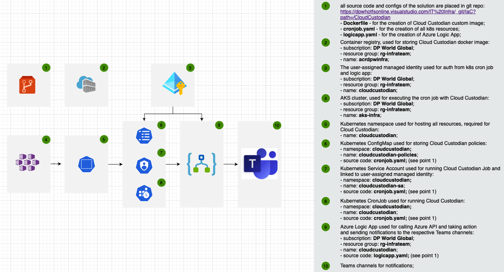

**Auto-shutdown using Cloud Custodian:**

The solution is based on the Cloud Custodian. It's open source solution for managing the cloud infra: https://cloudcustodian.io

**Prerequisites:**

•	A resource must have a tag with name **scheduler** and value in the format: **off=(M-F,18);on=(M-F,8);tz=Asia/Dubai**

•	A resource must have a tag with the name **ENV** and value not-equal **PROD**

•	if you want to shutdown resource with tag **ENV=PROD** you **MUST** add additional tag **AutoShutdown=true** that confirms your intentions;

•	if you want to only shutdown resource (without autostart), you need additional tag **ManualStart=true** and **scheduler** tag like **off=(M-F,18);tz=Asia/Dubai**.
    Without **ManualStart=true** your resource will be started on default time anyway;

•	by default, all notifications go to the **Cloud Custodian automation** channel in **HO Cloud Team**

•	if you want to get notifications to your own Teams channel, you can add the tag **TeamsChannel=<channel_name>** to your resource

•	more information about scheduling options can be found here: https://cloudcustodian.io/docs/aws/examples/offhours.html?highlight=offhour#module-c7n.filters.offhours

•	the solution is provided as IaC (Infrastructure as Code) and the source code can be found here: https://dpwhotfsonline.visualstudio.com/IT Infra/_git/IaC?path=/CloudCustodian

•	the architectural diagram is displayed below:

